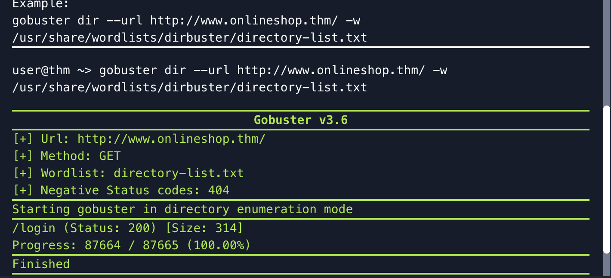
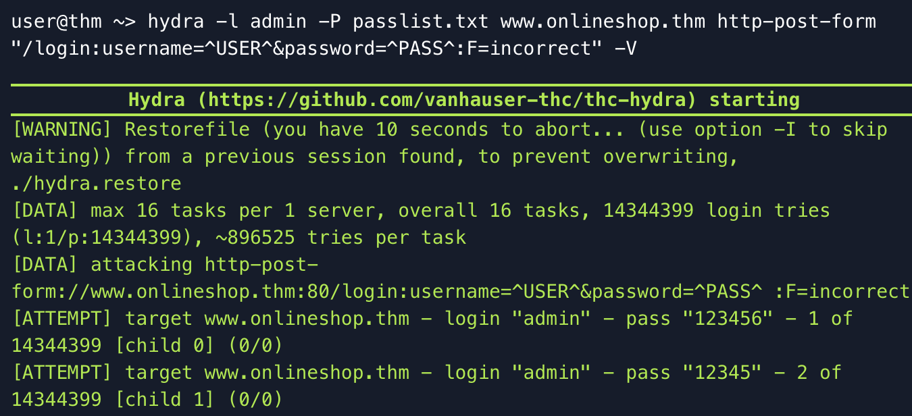

# Web Enumeration & Password Attacks
## TryHackMe — Become a Hacker Room

---

## What this room was about

This room introduced core offensive security concepts including:

- Red Teaming
- Penetration Testing
- Vulnerabilities
- Exploits
- Scope and authorization

The practical exercise focused on assessing a web application to discover hidden pages and test weak authentication mechanisms.

The scenario involved helping a fictional business owner identify exposed functionality before launching a website publicly.

The exercise combined:

- Manual web page discovery
- Automated directory enumeration
- Password attacks using a dictionary wordlist
- Thinking like an attacker in an ethical and authorized way

---

## Commands I actually used

| Command | What it does |
|---|---|
| `gobuster dir --url http://www.onlineshop.thm/ -w /usr/share/wordlists/dirbuster/directory-list.txt` | Scans a website for hidden directories and pages |
| `hydra -l admin -P passlist.txt www.onlineshop.thm http-post-form "/login:username=^USER^&password=^PASS^:F=incorrect" -V` | Performs an automated dictionary attack against the login page |
| `/login` | Hidden page discovered during enumeration |
| `admin : [redacted]` | Valid credentials discovered during testing |

---

## What I actually learned

- Hidden pages can sometimes be discovered by testing common directory names manually
- Gobuster automates directory and file enumeration much faster than manual testing
- HTTP status codes matter — a `200 OK` response confirmed the hidden login page existed
- Weak passwords are still one of the most common security issues
- Hydra automates password attacks using predefined wordlists
- Small weaknesses can be chained together into larger compromises
- Ethical hacking always requires authorization and defined scope

---

## Key offensive security concepts

| Term | Meaning |
|---|---|
| **Red Teaming** | Simulating real-world attacks to test defenses |
| **Penetration Testing** | Authorized security testing to identify vulnerabilities |
| **Vulnerability** | A weakness that can be abused |
| **Exploit** | A method used to take advantage of a vulnerability |
| **Scope** | Defines what systems and actions are authorized during testing |

---

## Results from the exercise

| Finding | Result |
|---|---|
| Hidden page discovered | `/login` |
| Status code returned | `200` |
| Password discovered | `qwerty` |
| Secret message | `THM{born_to_hack!}` |
| Failed password attempts before success | `17` |

---

## Why this matters for SOC work

Web enumeration, authentication attacks, and repeated login failures are all common indicators SOC analysts monitor during investigations.

Understanding how attackers discover hidden functionality and abuse weak credentials helps analysts:

- Detect brute-force attacks
- Investigate suspicious login activity
- Recognize exposed web application risks
- Understand attacker methodology during incident response

---

## Screenshot

### Gobuster Enumeration

### Hydra Dictionary Attack

---

